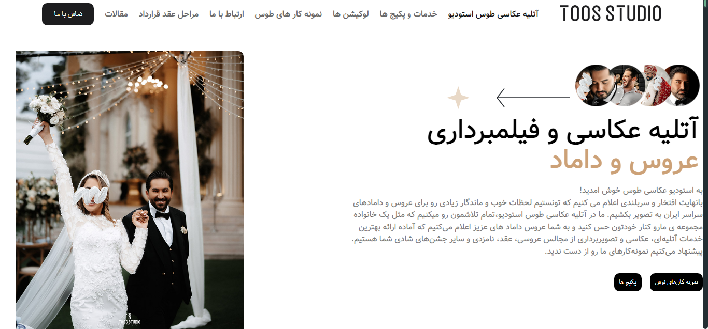

# PhotoGraphy
In the name of god


<h1 align="center" id="title">PhotoGraphy</h1>


<p id="description">Its a site that you could utilize its equipment and its features</p>

<h2>🚀 Demo</h2>

<h2>Project Screenshots:</h2>




  
  
<h2>🧐 Features</h2>

Here're some of the project's best features:

*   Mobile-first
*   Full-responsive
*   Attractive User-Interface

<h2>🛠️ Installation Steps:</h2>

<p>1. Import it rapdly </p>
<p>1. In this version , there is not any special depedencies😎</p>

```

```

<h2>🍰 Contribution Guidelines:</h2>

Its free to use it but you can change the languages and the main structure of this website as you want💖

  
  
<h2>💻 Built with</h2>

Technologies used in the project:

*   Html5
*   Javascript
*   CSS3
*   Aos
*   SASS
*   Tailwind

<h2>🛡️ License:</h2>

This project is licensed under the Code-master\_\_movie

<h2>💖Like my work?</h2>

If you have any question you can send a messsage to : alihj4223@gmail.com
 

